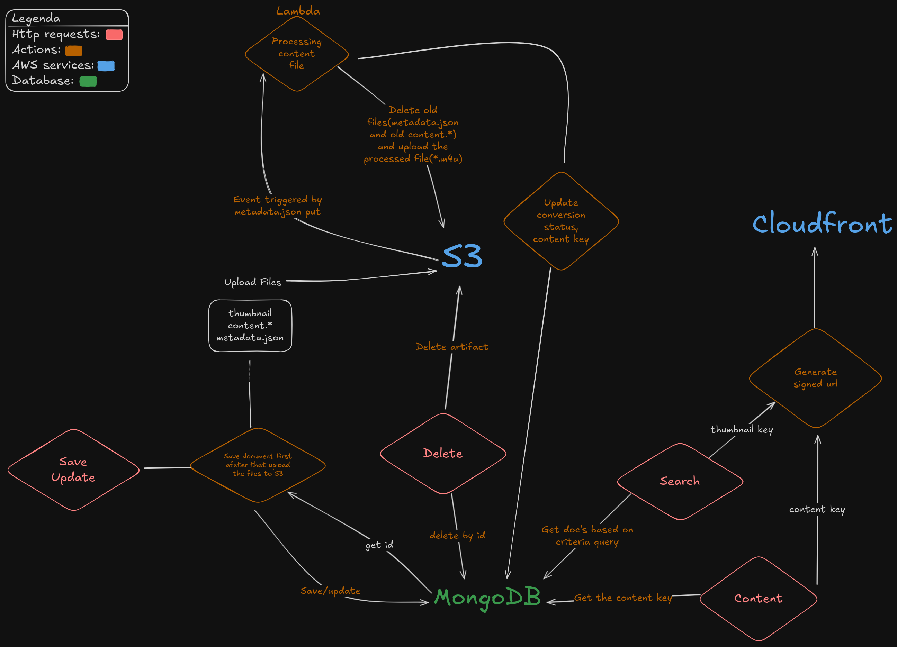

# [Streaming Cloudnative Project](http://d130vf1311tsqd.cloudfront.net/swagger-ui/index.html)
[Versão em Português](doc/README_pt.md)  
This project is a cloud-native streaming that is designed to store, manage, process and deliver static media content such music and podcasts. It is build using modern technologies and follows best practices in software development. The project is designed to be scalable, reliable, and easy to maintain.

## Showcase
[](https://streamable.com/b8pheo)   
**PS: Click on the image to watch the video.**

## Main Technologies
- **Robust Api**: Uses a robust API writen in Java with Spring boot. The API is designed to be easy to use and provides a wide range of features for managing media content. To see more details about the API, please see the [API Doc](https://github.com/LuigiPereira1709/streaming-api).     
- **Serverless Function**: Implements a serverless function using AWS Lambda to process media content. The function is designed to be scalable and cost-effective, allowing for efficient processing of media files. To see more details about the serverless function, please see the [Serverless Function Doc](https://github.com/LuigiPereira1709/lambda-audio-converter).    
- **AWS Native**: Uses AWS Native services to provide a scalable and reliable infrastructure for the project.

## Pre-requisites
### IAM
Create IAM roles with the following policies and permissions examples below:
Permission Group
```json
{
  "Version": "2012-10-17",
  "Statement": [
    {
      "Sid": "S3GlobalPermissions",
      "Effect": "Allow",
      "Action": ["s3:GetObject", "s3:PutObject", "s3:DeleteObject"],
      "Resource": "your-media-bucket-arn-here/*"
    }
  ]
}
```  

API Trust and Permissions 
- Trust policy:
```json 
{
  "Version": "2012-10-17",
  "Statement": [
    {
      "Effect": "Allow",
      "Principal": {
        "Service": "ec2.amazonaws.com"
      },
      "Action": "sts:AssumeRole"
    }
  ]
}
```
- Permissions policy:
```json
{
  "Version": "2012-10-17",
  "Statement": [
    {
      "Sid": "AllowSSMAccess",
      "Effect": "Allow",
      "Action": [
        "ssm:*",
      ],
      "Resource": "*"
    },
    {
      "Sid": "AllowSecretsManagerAccess",
      "Effect": "Allow",
      "Action": "secretsmanager:GetSecretValue",
      "Resource": "your-secret-arn-here"
    },
    {
      "Sid": "AllowScriptBucketRead",
      "Effect": "Allow",
      "Action": "s3:GetObject",
      "Resource": "your-script-bucket-arn-here/*"
    },
    {
      "Sid": "AllowCloudFrontInvalidation",
      "Effect": "Allow",
      "Action": "cloudfront:CreateInvalidation",
      "Resource": "your-cloudfront-distribution-arn-here"
    }
  ]
}
```

Serverless Function Trust and Permissions
- Trust policy:
```json
{
  "Version": "2012-10-17",
  "Statement": [
    {
      "Effect": "Allow",
      "Principal": {
        "Service": "lambda.amazonaws.com"
      },
      "Action": "sts:AssumeRole"
    }
  ]
}
```
- Permissions policy:
```json
{
  "Version": "2012-10-17",
  "Statement": [
    {
      "Sid": "BasicLambdaLogging",
      "Effect": "Allow",
      "Action": [
        "logs:CreateLogGroup",
        "logs:CreateLogStream",
        "logs:PutLogEvents"
      ],
      "Resource": "your-log-group-arn-here"
    },
    {
      "Sid": "S3MediaBucketListAllPrefixes",
      "Effect": "Allow",
      "Action": "s3:ListBucket",
      "Resource": "your-media-bucket-arn-here"
    }
  ]
}
```

### Database
Create a MongoDB database with the following schemas validators:
- [Music Schema](database/music_schema.js)
- [Podcast Schema](database/podcast_schema.js)

## Project Structure
```plaintext
.
├── database/       # Contains database schemas and validators
├── doc/            # Extra documentations
├── iam/            # Contains IAM policies and permissions examples
│   └── examples/
│       ├── backend/    # Backend IAM policies
│       ├── lambda/     # Lambda IAM policies
│       └── permission_group.json  # Permission group example
│
├── lambda-audio-converter/  # Serverless function for audio conversion
└── streaming-api/           # API for managing media content
```

## System Design


## Links 
[Access My API](http://d130vf1311tsqd.cloudfront.net/swagger-ui/index.html)

## License
This project is licensed under the GNU GPL v3.0 license. See the [LICENSE](LICENSE.txt) file for details.
